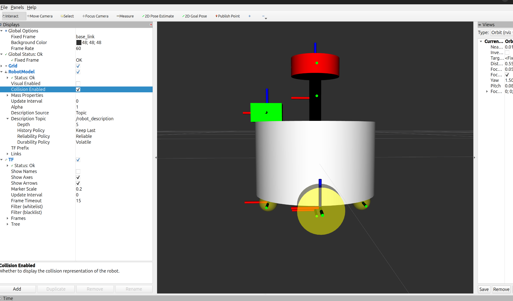

# 2026-10-01 ROS2 学习记录与学习快照

## 今日目标与课程断点

继续第六章 URDF/Xacro 建模，承接 6.2.3 附近的学习，推进机器人部件拆分与总装。今日已完成二轮差速小车的 base、wheel、caster、laser、camera 模块并在 RViz 验证视觉/碰撞显示；精确课程小节和播放秒数未重新确认，不将实验跑通等同于独立完成章节验收。

## 闭卷回顾结果

未提供今日闭卷独立复现或延迟测试证据，MASTERY 等级保持不变。

## 今日学习内容

- 使用 include、macro、参数和 `${}` 组织多文件模型；link 描述刚体，joint 描述父子刚体的位置和运动关系，origin 的 xyz/rpy 描述平移和姿态。
- `cylinder radius/length`：半径和沿圆柱自身 Z 轴的长度；`box size="x y z"`：三个轴方向的尺寸，长度采用米。
- `box_inertia m/w/h/d`：质量与三个尺寸。按实际 `common_inertia.xacro` 公式，w→X、h→Y、d→Z；这由宏定义决定，并非 URDF 对变量名的规定。相机质量 0.05 kg，尺寸 0.05 × 0.04 × 0.03 m。
- `cylinder_inertia m/r/h`：质量、半径、轴向长度。当前宏按圆柱轴为惯性坐标系 Z 轴计算；几何旋转后还需核对惯性坐标系。
- `visual` 决定外观，`collision` 定义碰撞几何，`inertial` 定义质量与转动惯量。三者必须是 link 的同级子元素；惯性宏调用展开后生成 inertial。
- 在 RViz RobotModel 中分别切换 Visual Enabled / Collision Enabled，配合 TF 坐标轴与父子树检查模型。

## 今日排错与提交前源码检查

| 问题 | 原因、处理与实际检查结果 |
|---|---|
| camera 碰撞不显示 | 对话中的 `collission` 拼写错误，应为 `collision`；虚拟机当前源码已修正，visual、collision、惯性宏位于 link 同级 |
| laser 碰撞/惯性不生效 | 对话中错误嵌套在 visual 内；实际源码中 laser_link 与 laser_cylinder_link 的 collision 和惯性宏均已移到 link 下 |
| 雷达材质残留层级错误 | 本次检查发现 laser_link/material 直接位于 link 下；已移回 visual 内，同步修正虚拟机实际源码与归档快照 |

正确结构：

```text
link
├── visual
│   ├── geometry
│   └── material
├── collision
│   └── geometry
└── inertial（由惯性宏展开生成）
```

注意：XML 能解析，不代表 URDF 标签语义全部正确；应同时检查父子层级及展开后的模型。

## 学习快照：实际模型关系

```text
base_footprint
└── base_link [fixed]
    ├── left_link [continuous，axis=0 1 0]
    ├── right_link [continuous，axis=0 1 0]
    ├── front_link [fixed，球形脚轮]
    ├── back_link [fixed，球形脚轮]
    ├── camera_link [fixed]
    └── laser_cylinder_link [fixed，支柱]
        └── laser_link [fixed，雷达]
```

轮子实际使用 continuous joint，不应把所有连接都称为 fixed。传感器安装关系为 fixed；TF 展示这些父子 frame 关系。IMU 文件已存在且被 include，但实例化被注释，因此当前总装没有 imu_link。当前已跑通的是模型描述与显示，尚不能据此认定差速运动控制、真实传感器数据或物理仿真完成。

## RViz 学习证据



原对话附件「截屏2026-10-01 下午9.35.25.png」：Fixed Frame 为 base_link，Visual Enabled 关闭、Collision Enabled 开启，RobotModel 与 TF 状态均为 Ok；底盘、轮子、脚轮、相机、雷达和支柱碰撞体可见。该截图证明学习时碰撞显示已基本跑通；它是本次修正雷达材质之前的用户截图，不冒充本次重新启动 RViz 的结果，也不能证明惯性参数物理正确。

源码与本次验证结果见 [机器人模型源码快照](../ros2/chapt6_ws/README.md)。本次先遇到 SSH 认证失败，随后通过 Parallels 读取实际工作区，不再将源码检查标为无法执行。

## 下一次测试与下一步

1. 闭卷解释 visual/collision/inertial，复现 collision 拼写和嵌套错误，再通过展开结果与 RViz 定位。
2. 修改 camera 的一个尺寸，同步修改碰撞体与惯性参数，解释 w/h/d 与轴的映射。
3. 从 base_footprint 画出实际 TF 树，区分轮子的 continuous 与传感器的 fixed，解释 joint_state_publisher 的作用。
4. 核对轮子的惯性坐标系：visual/collision 已绕 X 旋转 1.5708，而当前惯性宏没有对应 origin；进入动力学仿真前处理，不能用碰撞显示成功代替惯性验收。
5. 补齐 package.xml 的运行依赖声明；旧 display_robot.launch.py 引用的旧模型路径需核对，当前使用 display2_robot.launch.py。按课程继续，IMU 是否启用待下一步确定。

历史 TF listener、Service/Patrol 及独立验收事项继续保留。今日来源为用户学习摘要、引用对话《解释 whd含义》、原始 RViz 截图及虚拟机实际源码。
