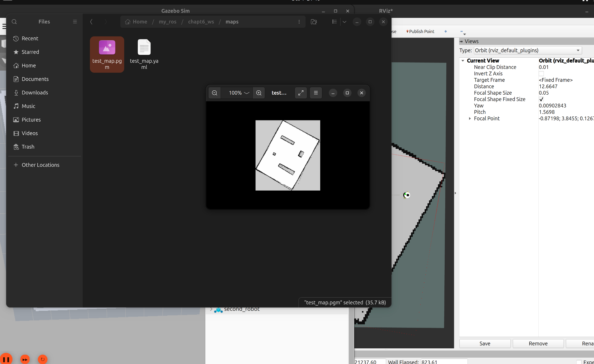

# 2026-10-04 ROS2 / SLAM 建图与地图保存

## 今日目标

继续 Chapter 7 的 SLAM Toolbox 在线建图，解决昨天地图重影、红色 LaserScan 与地图错位的问题，把建好的地图保存下来。

今天已完成 **Chapter 7 / 7.2.1 在线 SLAM 建图**，并成功保存地图。下一步是地图加载、已有地图定位和后续导航课程。

## 闭卷回顾结果

今天主要在仿真里做对比和排错，没有单独做闭卷复现或延迟测试。建图跑通记为课程进展，MASTERY 等级暂不调整。

## 今日真正掌握

- 地图重影时先对照实际运动和 odom，不要看到漂移就反复改轮径、轮距。
- 当前这套仿真对运动方式和碰撞很敏感。低速、连续转弯比频繁原地旋转更容易保持地图稳定，撞墙也会破坏建图效果。
- 换 world 文件时，还要核对 SDF 内的 world 名与 launch 中 spawn 的 `-world` 参数；文件名和 world 名是两回事。
- `/map` 是运行中的地图消息；保存后得到的 PGM 图片和 YAML 参数文件，才是后续重新加载地图的输入。

## 做过的代码或实验

### 1. 对比 odom 与 Gazebo

今天继续排查地图重影和红色 `/scan` 与 OccupancyGrid 错位。直线测试中，Gazebo 位移约为 5.65768 m，odom 约为 5.660 m，两者基本一致。这支持暂时保留现有轮径、轮距，不再盲目调整。

直线结果不能单独证明所有转弯工况都准确，也没有新的证据说明昨天提出的轮子惯量修改已经完成。今天先把注意力放到实际运动方式、碰撞和扫描更新率上。

### 2. 换用静态仓储测试场景

导入并使用 `testworld.sdf`，以静态墙体和仓储障碍物进行建图。场景内的 `<world name="my_world">` 与 launch 中 `-world my_world` 保持一致，避免换了 SDF 文件后 spawn 仍指向旧 world。

### 3. 调整 LiDAR 更新率和遥控方式

将 `gpu_lidar` 的 `update_rate` 从 10Hz 提高，今天采用 20Hz：

```xml
<update_rate>20</update_rate>
```

遥控时主要使用 `u`、`o`、`m` 等带线速度的弧线运动，低速绕开障碍物，避免使用 `j`、`l` 频繁原地旋转，也避免撞墙。配合上述调整，建图稳定性明显改善，最终 Gazebo 场景与 RViz 中的 OccupancyGrid 基本一致。

这是当前仿真条件下的有效操作经验，并不表示所有差速机器人建图都不能原地旋转，也没有通过单变量实验确定每项调整各自的影响。

### 4. 保存地图

建图完成后保持 Gazebo、控制器、扫描桥接、SLAM Toolbox 与 RViz 运行，在 Ubuntu 工作区新开终端保存：

```bash
cd ~/my_ros/chapt6_ws
source /opt/ros/jazzy/setup.bash
source install/setup.bash
mkdir -p ~/my_ros/chapt6_ws/maps
ros2 run nav2_map_server map_saver_cli \
  -f ~/my_ros/chapt6_ws/maps/test_map
ls -lh ~/my_ros/chapt6_ws/maps
```

最后生成了 `test_map.pgm` 和 `test_map.yaml`。PGM 保存栅格图片，YAML 记录图片路径、分辨率、原点和占用阈值等信息；具体数值以后以实际文件为准。

## 暴露的问题

- 当前仿真在原地旋转或碰撞时仍容易出现不稳定，之后需要结合扫描、TF 时间和运动数据继续分析，不能只凭最终成功倒推出唯一根因。
- 提高配置更新率不等于已经测得 ROS2 `/scan` 稳定达到 20Hz，后续可以补录实际频率。
- 本次归档保存学习记录和截图，未从 Ubuntu 同步最新 Xacro、launch、`testworld.sdf` 或地图原文件，也未在 Mac 上重跑 ROS2。仓库中的旧源码快照不代表今天的最终运行配置。

## 下一次测试

1. 重新加载已保存的 `test_map.yaml`，确认 PGM 路径有效、地图显示正常。
2. 解释在线建图与已有地图定位的区别，再按课程进行定位实验。
3. 完整重启后复现静态场景、20Hz 配置和低速弧线建图，保存 `/scan` 实际频率及必要的 TF/odom 数据。
4. 后续同步实际配置与地图文件，补齐可复现实验材料，再进入导航课程。

## 证据与参考资料

依据 2026-10-04 学习会话、当日实验结果及成功截图整理。截图中可见 `~/my_ros/chapt6_ws/maps` 下的 `test_map.pgm`、`test_map.yaml`、打开的地图图片和背景中的 RViz/Gazebo；场景完整对齐的结论结合当日建图反馈记录。



原图：`截屏2026-10-04 下午9.40.37.png`，原样归档，未修改图片内容。此前排错过程见 [10 月 3 日记录](2026-10-03.md)。
